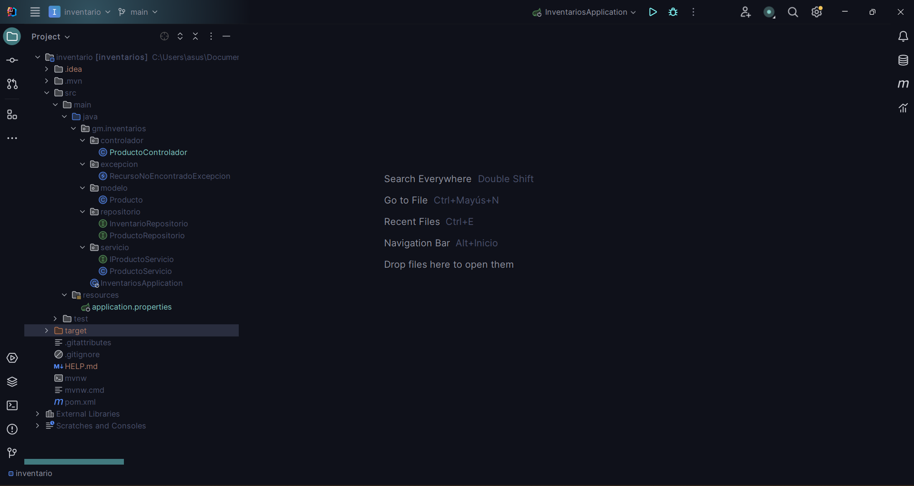

# Sistema de inventario 
## _BackEnd_

Este repositorio contiene la lógica del BackEnd de la aplicación web Sistema de Inventario. La aplicación está desarrollada en Java utilizando el framework Spring Boot, con MySQL como base de datos y Maven como herramienta de gestión de dependencias y construcción.

El objetivo principal de esta aplicación es servir como práctica para el entrenamiento en:
* Lógica de programación en el BackEnd
* Conexión con bases de datos
* Comunicación entre el BackEnd y el FrontEnd
* El FrontEnd de la aplicación se encuentra en un repositorio aparte.

A continuación, se describe el proceso de instalación, funcionamiento general, estructura de paquetes y los pasos necesarios para ejecutar el sistema correctamente.

🚀 Desarrollo

Esta aplicacion se realizo con Java, SpringBoot para una mayor facilidad de la configuracion y del despliege en la ejecucion de la aplicacion, para la base de datos se uso MySQL como gestor de la informacion contenida y a guardar cambios realizados desde las vistas, tambien se usaron librerias como Lombook, Java Web, MySQL para tener mayor facilidad en el despliege de la aplicacion y configuracion

🖥️ Tecnologias:
  * Java version 21
  * MySQL
    
<a href="https://www.java.com/es/" target="_blank" rel="noreferrer">  </a>  <a href="https://www.mysql.com/" target="_blank" rel="noreferrer">  </a> 
 
🔧 Herramientas:
  * IntelliJ IDEA
  * Postman

<a href="https://www.jetbrains.com/idea/" target="_blank" rel="noreferrer">  </a>  <a href="https://www.mysql.com/" target="_blank" rel="noreferrer">  </a> 

 
⚓ Descarga y uso

Para hacer uso del este repositorio se debe clonar con este link => https://github.com/Esteban-02/Sistema_inventario_Productos.git

Se debe configurar la version de Java a la version 21 para evitar inconvenientes con las versiones mas recientes, recargar los paquetes y revisar los paquetes

Para mirar todo el proyecto completo se debe descargar o clonar el repositorio del FrontEnd en este link en donde estan las instrucciones y anotaciones => https://github.com/Esteban-02/Sistema-Inventario-Frontend

🔩 Configuracion


Para configurar la base de datos se deben hacer algunos cambios, para el desarrollo de esta aplicacion se hizo con una base de datos local con las configuraciones como usuario y contraseña, en la siguiente imagen se muestra la configuracion


```properties
spring.application.name=inventarios
spring.datasource.url=jdbc:mysql://localhost:3307/inventario_db?createDatabaseIfNotExist=true
# Cambiar el usermane segun configuracion de la base de datos local
spring.datasource.username=root
# # Cambiar el password segun configuracion de la base de datos local     
spring.datasource.password=root
spring.datasource.driver-class-name=com.mysql.cj.jdbc.Driver
spring.jpa.hibernate.ddl-auto=update
spring.jpa.show-sql=true

# Configurar el patron de log
logging.pattern.console=[%thread] %-5level: %logger -%msg%n
# Configurar el nivel de log (INFO)
logging.level.root=INFO

spring.main.banner-mode=off
```
En la URL de la base de datos se crea automaticamente por el puerto 3307, para instalacion y correcto funcionamiento se debe verificar los puertos asigandos en la base de datos local de su computadora y cambiarlos si es necesario ya que MySQL opera por defecto por el puerto 3306 y para el desarrollo se hizo con este puerto

El _patron Log_ solo muestra informacion en la consola al operar las peticiones o mostrar estados dentro del BackEnd

🎮 Pruebas PostMan

Para hacer pruebas de Postman del funcionamiento de esta base y el correcto funcionamiento se realizaron pruebas con los metodos POST, GET y DELETE por la URL http://localhost:8080/inventario-app/productos como se muestra en las imagenes

  * Metodo GET: Listar productos con un archivo JSON 


  * Metodo POST: Agregar nuevo se hace a traves de un JSON digitando los valores manualmente


  * Metodo DELETE: Eliminar un producto a traves de la URL con el ID


  * Medoto GET: Buscar producto a traves de la URL con el ID


📸 Capturas
  * Imagen de la consola del BackEnd mostrando las operaciones que se realicen en cada solicitud


  * Imagen mostrando los datos guardados en la base de datos


  * Paquetes y clases creadas



📝 Notas:
Ejecutar el BackEnd para mirar el funcionamiento de la base de datos en el FrontEnd, cada peticion se realizo a traves del controlador por el puerto por defecto de Angular 4200

Preguntas o informacion en mi perfil de Linkedin o correo electronico.

LinKedin: www.linkedin.com/in/esteban-ortega-dsf

Gmail: oesteban02@gmail.com

Facebook: https://www.facebook.com/esteban.ortega.2230

Muchas gracias por su atencion
    
